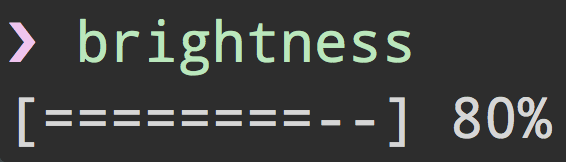

<h1 align="center">
	<br>
	
	<br>
	<br>
	<br>
</h1>

> Change the screen brightness

[](https://travis-ci.org/kevva/brightness-cli)


## Install

```
$ npm install --global brightness-cli
```


## Usage



```
$ brightness --help

  Example
    $ brightness
    $ brightness 0.8
```


## Related

* [brightness](https://github.com/kevva/brightness) - API for this module


## License

MIT © [Kevin Mårtensson](https://github.com/kevva)
